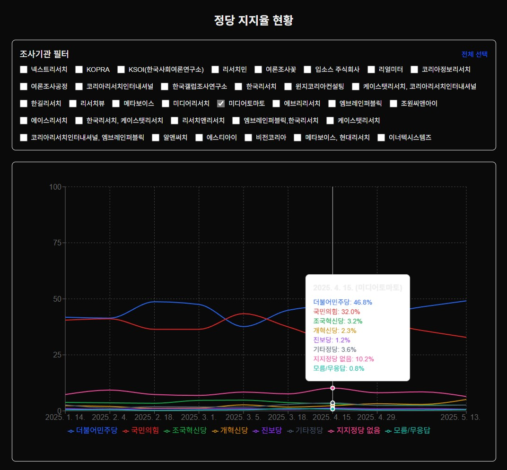

# 대한민국 정당/후보 지지율 시각화

이 프로젝트는 대한민국의 정당 및 대선 후보 지지율 데이터를 시각화하는 개인 실험 프로젝트입니다.

## 기능

- 정당별 지지율 트렌드 시각화
- 대선 후보 지지율 시각화 (🚧 공사중)
- 조사기관별 필터링
- 상세 데이터 테이블 제공

## 기술 스택

- Next.js
- TypeScript
- Recharts
- Tailwind CSS

## 데이터

- 데이터는 [중앙선거여론조사심의위원회](https://nesdc.go.kr/)에서 제공하는 정보를 활용했습니다
- 개인적인 테스트 목적으로만 사용되었으며, 공식적인 용도로 사용할 수 없습니다
- `data/party.csv`에서 기초 데이터를 관리

## 실행 방법

```bash
# 1. 의존성 설치
npm install

# 2. CSV 데이터를 JSON으로 변환
npm run export-data

# 3. 개발 서버 실행 (http://localhost:3000)
npm run dev
```

## 사용된 명령어 설명
- `export-data`: CSV 파일의 데이터를 JSON으로 변환합니다
- `dev`: 개발 서버를 실행합니다

## 주의사항

이 프로젝트는 학습 및 실험 목적으로 만들어졌으며, 실제 데이터는 테스트용으로만 사용되었습니다. 
데이터의 정확성이나 최신성을 보장하지 않습니다.

## 스크린샷


- 정당별 지지율 추이를 시각적으로 확인할 수 있습니다
- 조사기관별 필터링이 가능합니다
- 마우스 오버 시 상세 정보를 확인할 수 있습니다

## 작성자

inhwan Hwang
